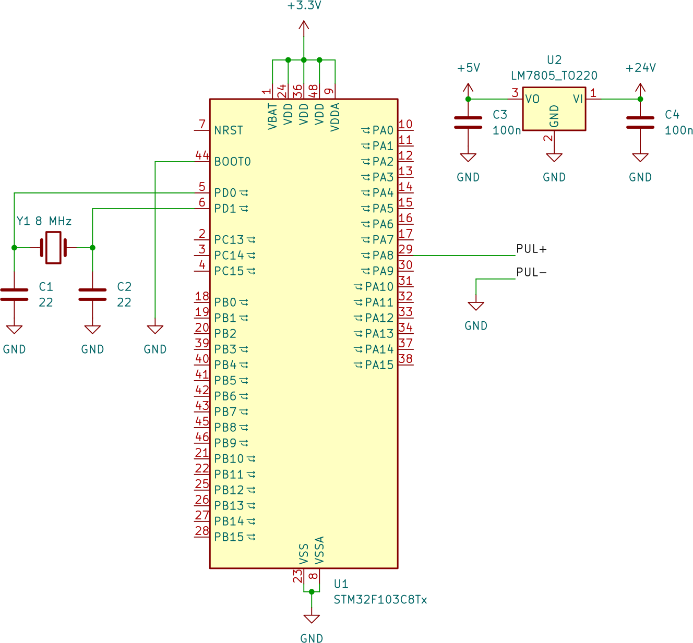
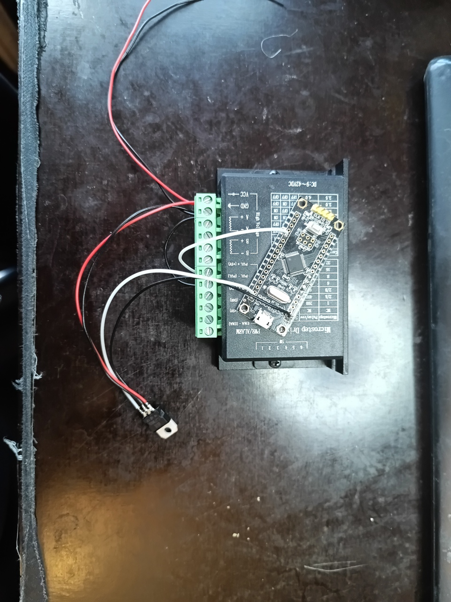
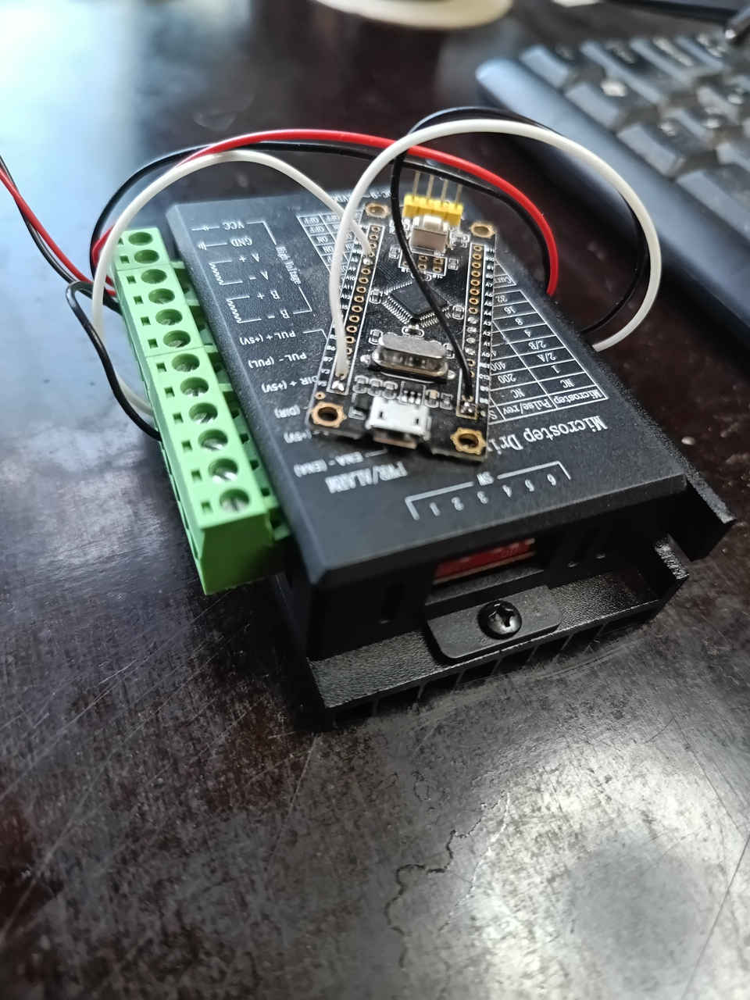
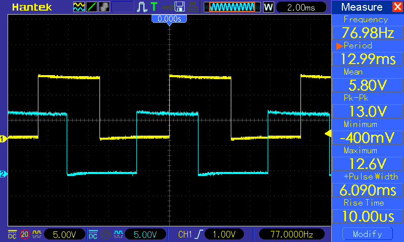
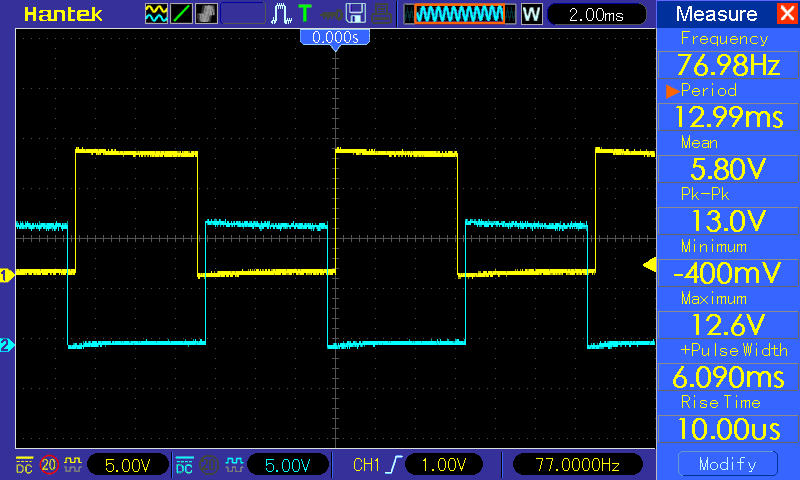

# Тактовый генератор драйвера шагового двигателя.
В качестве генератора тактовых импульсов применена макетная плата Blue Pill с микроконтроллером STM32F103C8T6. Код написан на C с использованием библиотеки LibOpenCM3.

В качестве драйвер шагового двигателя использован китаец на TB6600. Упрощённая схема устройства приведена на рисунке, макетная плата показана схематично, внутренний стабилизатор 5В -> 3.3В опущен. Питается устройство от источника питания двигателя, через стабилизатор на LM7805, который следует установить на радиатор.

Устройство в сборе.

Осциллограммы выходных сигналов драйвера.
Осциллограммы выходных сигналов канала А

Осциллограммы выходных сигналов каналов А и B

Частота сигнала на обмотке задаётся директивой `#define OUTPUT_FREQ XX` в `stepdrv.c`, где XX частота в герцах.

# Instructions
 
 1. $sudo pacman -S openocd arm-none-eabi-binutils arm-none-eabi-gcc arm-none-eabi-newlib arm-none-eabi-gdb
 2. $git clone https://github.com/5881/stepdriver_v2.git
 3. $cd stepdriver_v2
 4. $git submodule update --init # (Only needed once)
 5. $TARGETS=stm32/f1 make -C libopencm3 # (Only needed once)
 6. $make 
 7. $make flash

Александр Белый 2026

@candidum5881
